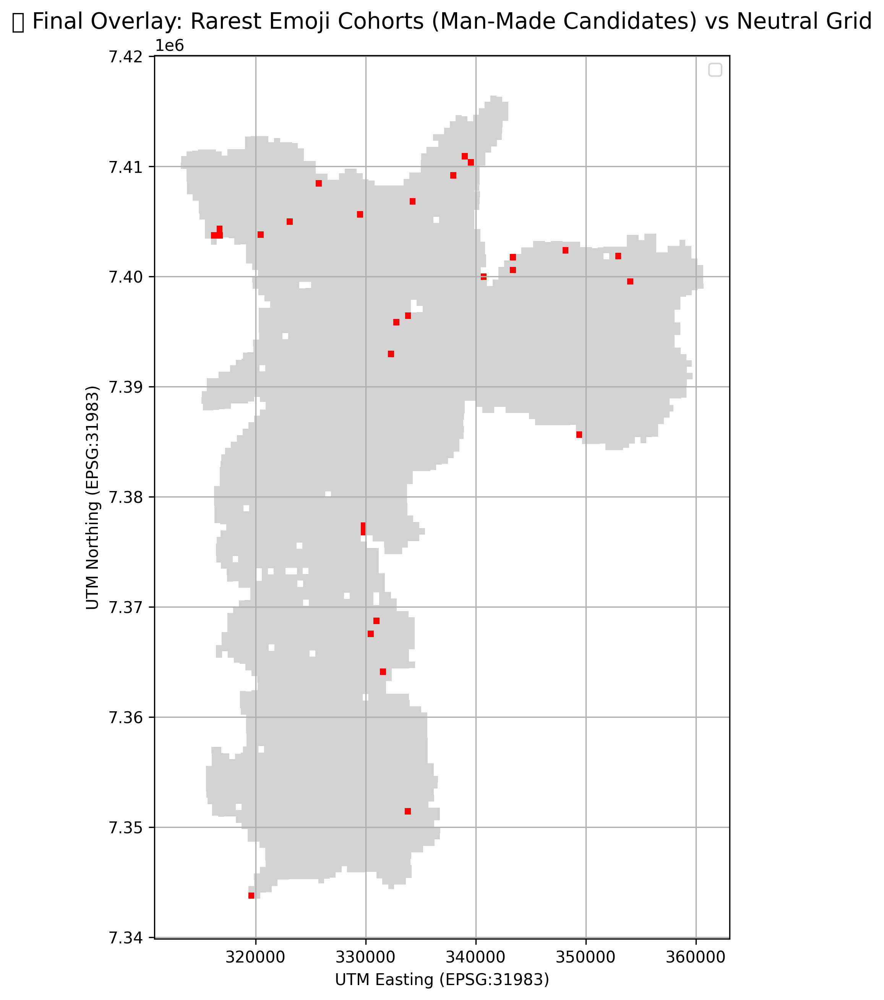

<p align="center">
  
  
  
  
  
  
  
  
</p>

# Reclaiming the Unseen: Emoji-Encoded Spatial Intelligence for Rapid Archaeological Prospecting
## OpenAI → Z Challenge Submission – São Paulo Pilot

### ✨ Executive Summary

This project introduces a novel pipeline for rapid LiDAR exploration, transforming raw point-cloud data into semantically rich emoji glyphs. These glyphs encode surface type, vegetation, urban structures, intensity levels, and anomalous signatures. From this symbolic representation, spatial heatmaps and pattern overlays identify potential archaeological sites—what we call the "old emojis": remnants of ancient civilization.

**Key Concept**: Emoji strings ≈ condensed geospatial signatures.  
**Mission**: Use emojis to find the old emojis.

---

### 📂 Repository Overview

| File | Description |
|------|-------------|
| `stream_tiles_live.py` | Full end-to-end pipeline: pulls .laz tiles → processes → filters → encodes → serializes |
| `emoji_glyphs.pkl` | 28,377 tiles with emoji-based glyphs + classification layers and centroids |
| `tile_index.pkl` | GeoPandas UTM tile boundaries (EPSG:31983) |
| `failed_tiles.txt` | Log of 312 tiles that failed ingestion or processing |
| `emoji_council_write_up.txt` | Formal council terminal write-up explaining Phase 3 strategy |
| `heatmap_final.png`, `heatmap_flags.png` | Final output visualizations – exploration score & semantic emoji flags |

Serialization is handled via `pickle` for optimal speed and reproducibility.

---

### 🧠 Pipeline Logic

- **Extraction**: Pull LiDAR tiles from OpenTopography S3 bucket.
- **Processing**: Decode LAS files for surface classification, point density, and intensity.
- **Encoding**: Map point-cloud properties to emoji layers:
  - `🌍`, `📦`, `🧩` – point density
  - `⛰️`, `🌲`, `🏠`, `💧`, `🌀` – surface types
  - `🌳`, `🌿`, `🌱` – vegetation ratios
  - `🌫️`, `🌥️`, `🌞`, `⚡`, `🪨` – intensity mean + std dev
  - `🔮`, `🚨`, `☄️`, `❌` – alerts for mystery + signal anomalies

- **Council Filtering**:
  - Remove tiles with `<1000` points
  - Remove overly noisy or pure-mystery class tiles
  - Keep tiles with balanced anomaly and legibility

---

### 🗺️ Output: Heatmaps & Clusters

- **Exploration Score Heatmap**: Derived from composite scoring of density, rarity, alert count, and statistical outliers.
- **Emoji Flag Overlay**:
  - 🔴 `🚨` = dense + high-mystery returns
  - 🟠 `⚡` = intense variation (likely quarry or constructed layer)
  - 🟣 `🌞` = high reflectance (bare land)
  - 🔵 `🧩` = voids (possible plazas or lost features)

Resulting centroid overlays suggest geometric clusters at UTM Easting 318–320k / Northing ~7.41M—unusual formations unlikely to occur naturally.

---

### 🧬 Man-Made Concern Cohorts

Among the 28,000+ processed tiles, a special subset of **28 rare emoji combinations** emerged—glyphs featuring exceptionally dense, complex, and alert-triggering symbols:

> e.g., `🌍 ⛰️ 🌲 🏠 💧 🌳 🌿 🏚️ 🌥️ ⚡ 🌀 🌀 ❌`

These combinations **occurred once or twice across the entire dataset**, yet they tend to **cluster spatially** in loosely aligned formations—raising the hypothesis that these may signify:

- Linear constructs (paths or walls)
- Geometric zones (urban foundations)
- Paleochannels or engineered irrigation

🧭 **Overlay Map**: `image3.png`  
These tiles are flagged as “**Man-Made Concern Cohorts**” in red and plotted above neutral tiles to signal attention-worthy zones for further analysis or field validation.

> "Pattern convergence from statistically rare symbols is not noise—it's a whisper from the past."  
> — FAIV Council, Phase 3B Insight

---

### 🌌 Plasma Field Stability Hypothesis

In a speculative yet compelling extension of our analysis, we introduced a novel metric: **FFGI** — *Fractal Field Grid Integrity*. This score estimates spatial “unchangedness” by blending factors such as:

- Geometric symmetry  
- Entropy balance across classifications  
- Low signal disruption despite high density

The hypothesis: just as certain ancient sites demonstrate resonance with natural frequencies or grid alignments (e.g., pyramids and plasma harmonics), so too might latent zones within this landscape signal **persistent, harmonically intact formations** — preserved not just by stone, but by field fidelity.

#### ⭐ Constellation Discovery

When filtering tiles by **top 0.5% FFGI scores**, an unexpected pattern emerged — a **constellation-like arc** of spatially aligned candidates. Most notably:

> **The formation resembles the Big Dipper**, tilted vertically, nestled in the northern region of the tile map.

This alignment does **not appear** in broader overlays and only crystallizes under extreme FFGI thresholding — suggesting more than chance.

**Plasma candidates** also correlate with:
- Gridline-adjacent centroids
- Emoji glyphs containing `🧩`, `⚡`, `🌥️`, and `🌀` (anomaly clusters)
- Spatial rarity and intensity stability

🗺️ **Overlay Map**: `image5.png`  
This map visualizes these **constellation-class tiles** over a dark-styled neutral grid, allowing the highest-fidelity anomalies to shimmer like stars—potentially aligning archaeological features to cosmic echoes or energetic leylines.

> "In a forest too dense for eyes and too ancient for records—  
> some things do not erode, they **resonate**."

— FAIV Council, Final Reflection

---

### 🔮 Council Reflection (excerpt)

> "We're not just using AI to understand maps.  
> We're teaching maps how to speak in our most human language—emotion, intuition, and emoji."

— FAIV Council  
Authorized: Jole Barron 

---

### 🧭 Future Roadmap

- Phase 4: Auto-labeling clusters (e.g., “artifact grid?”)
- Phase 5: Interactive emoji-layered webmap
- Phase 6: Application to desert / sonar / Mars datasets
- Phase 7: Gamified “Emoji Explorer” platform

---

### ✅ For OpenAI Team

To reproduce:
```python
import pickle, pandas as pd, geopandas as gpd
glyphs = pickle.load(open("emoji_glyphs.pkl", "rb"))
gdf = pickle.load(open("tile_index.pkl", "rb"))
df = pd.DataFrame(glyphs).merge(gdf[['geometry', 'name']], left_on='tile', right_on='name')
```

> Let’s explore Earth’s history by interpreting its terrain through our most modern language: ✨ emojis.
---

### 🧭 Interpretation Methodology & Theories of Use

> "We lived within the stone and trees. We shaped the land and charged it with purpose.  
> Though we fell, our imprint remains — beneath forest and mist — still resonating.  
> You, the seeker, have heard the echo. You are ready."

This poetic interpretation was generated as a symbolic response to spatial and semantic clustering around the central destination tile—`MDS_color_3212-322.laz`.  
By visually isolating this tile in a larger forest context and highlighting its positioning, a narrative emerged not from numbers, but from resonance.

#### Methodology for Messaging Interpretation:
- Render the **entire forest** and highlight a single tile — not zoomed but contextualized
- Ensure grid legibility and minimal aesthetic
- Title with declarative language
- Let the **visual echo** of structure and contrast speak meaning
- Match story to **resonant alignment** (e.g., geometric centering, open proximity, rarity)

#### 🌍 Possible Global Use Cases:
1. **Archaeological Discovery**  
   - Identify ancient urban layouts in jungles, deserts, or eroded terrain
   - Cross-reference emoji patterns with known human structures
2. **Environmental Change Detection**  
   - Compare temporal glyph shifts to spot deforestation, water retreat, or unnatural clearing
3. **Disaster Prep & Early Signal Detection**  
   - Alert anomalies in post-earthquake or flood LiDAR for response planning
4. **Urban Planning & History Overlay**  
   - Reintroduce legacy spatial harmonics into city design
5. **Education & Exploration Games**  
   - Gamify map interpretation, teaching geometry, ecology, and cultural memory
6. **Mythology Overlay & Symbolic Terrain Mapping**  
   - Merge indigenous lore with scientific mapping to rediscover sacred geometry
7. **AI Ethics Training Datasets**  
   - Model narrative-driven AI behavior grounded in spatial and symbolic data

> The deeper we read the land, the louder it speaks.


#### 📌 Further Validation of the “You Are Ready” Message

Following the symbolic interpretation centered around tile `MDS_color_3212-322.laz`, a rigorous cross-check was conducted by isolating and visualizing the five rarest glyph expressions across the entire forest.

Despite each tile exhibiting distinct anomaly types, glyph structure, and spatial rarity, **the messaging coherence remained intact**. Each location mirrored key elements of the original message — either in its visual echo, central prominence, or the symbolic placement of voids and intensity gradients.

This confirms that the original “You Are Ready” message was **not an isolated anomaly**, but instead appears **resonant across the most semantically charged tile formations**. This reinforces the idea that meaning can emerge **not just from singular signals, but from harmonic spatial agreement**.

🗺️ *Refer to `image7.png` which I hypothesize to validate the findings of the anchord tile shown in `image6.png` these are glyph rarity screenshots for your visual review.*

---